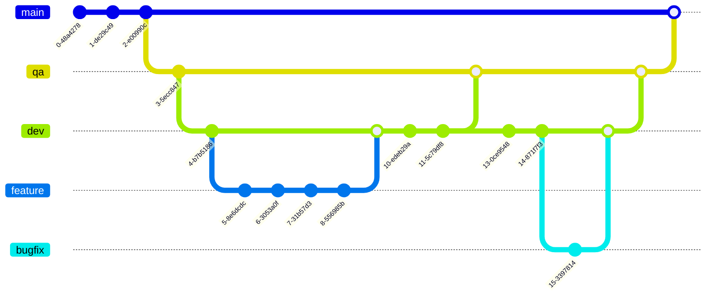

CICD
====

| Environment  | App Config | Deploy Config (current) | Deploy Config (ideal)  | Domain                       |
|--------------|------------|-------------------------|------------------------|------------------------------|
| preview      | dev        | preview                 | preview                | https://preview.csc.io      |
| dev          | dev        | preview                 | dev                    | https://platform-dev.csc.io |
| qa           | qa         | preview                 | qa                     | https://platform-qa.csc.io  |
| prod         | TODO       | preview                 | prod                   | https://platform.csc.io     |

For now, the deploy config for each environment will use the preview deploy config.
Later, when each environment has its own branch, then an independent deploy config will be assigned.

## Preview Deployment

1. Create a Pull Request using GitHub
2. Ask frontend team for permission to use preview environment
3. Add label to new Pull Request: `preview`
4. Monitor GitHub Action workflow in the Actions tab
5. Navigate to https://preview.csc.io

## Workflow



## CircleCI Deprecation Plan

1. Announce intention to switch over to GitHub Actions
1. Lock master branch developers from merging/committing changes into master, to prevent them from accidently deploying to prod
1. Create branches
    - create qa from master
    - create dev from qa
1. Change default branch to dev
1. Setup branch rules to
    - require pull requests against dev, qa, and master, and no direct commits to release branches
    - master needs 3 reviewers
        - requires at least one GitHub admin
    - qa needs 2 reviewer
    - dev needs 2 reviews
1. Switch deploy config for each GitHub environment to point from preview to its respective CDN
    - change deploy config for each environment on GitHub Actions
    - specifically prod, qa
1. Test/demo a release of something trivial
1. Remove CircleCI dependency from frontend source control csc-app

## AWS Architecture

- S3
    - Encryption Key Type: `Amazon S3 managed keys (SSE-S3)`
    - Block Public Access: `Block all public access`
    - Bucket Policy:
        ```javascript
        {
            "Version": "2008-10-17",
            "Id": "PolicyForCloudFrontPrivateContent",
            "Statement": [
                {
                    "Effect": "Allow",
                    "Principal": {
                        "Service": "cloudfront.amazonaws.com"
                    },
                    "Action": "s3:GetObject",
                    "Resource": "arn:aws:s3:::<BUCKET_NAME>/*",
                    "Condition": {
                        "StringEquals": {
                            "AWS:SourceArn": "arn:aws:cloudfront::<ACCOUNT-ID>:distribution/<DISTRIBUTION-ID>"
                        }
                    }
                }
            ]
        }
        ```
    - Lifecycle rules:
        - Rule 1:
            - Rule name: `MoveToCheapStorage`
            - Scope: `Entire Bucket`
            - Current Version Actions: `Transition to Intelligent-Tiering` (30 days)
        - Rule 2:
            - Rule name: `ExpireFiles`
            - Scope: `Entire Bucket`
            - Current Version Actions: `Expires` (90 days)
- CloudFront
    - Settings
        - Price Class: `Use only North America and Europe`
        - Supported HTTP Versions: `HTTP/2, HTTP/1.1, HTTP/1.0`
        - AWS WAF: TODO
        - Alternative Domain Names: TODO - Friendly Route53 domain name
        - Custom SSL Certificate: TODO - Friendly Route53 domain name certificate
        - Security Policy: `TLSv1.2_2021`
        - Default Root Object: `index.html`
    - Origins
        - Origin name: TODO - DNS name of S3 bucket
        - Origin domain: TODO: DNS name of S3 bucket
        - Origin access: `Origin access control settings (recommended)`
        - Origin access control
            - Sign Behaviour: `Sign Requests (recommended)`
            - Origin Type: `S3`
        - Enable Origin Shield: `No`
    - Behaviours
        - Path Pattern: `Default (*)`
        - Compress Objects Automatically: `Yes`
        - Viewer Protocol Policy: `Redirect HTTP to HTTPS`
        - Allowed HTTP Methods: `GET, HEAD, OPTIONS, PUT, POST, PATCH, DELETE`
        - Restrict Viewer Access: `No`
        - Cache Key and Origin Requests: `Cache policy and origin request policy (recommended)`
            - Cache Policy: `Caching Optimized`
- Route53
    - A Record (IPv4)
        - Record Name: TODO - custom domain name
        - Route Traffic To: `Alias to CloudFront distribution`
    - AAAA Record (IPv6)
        - Record Name: TODO - custom domain name
        - Route Traffic To: `Alias to CloudFront distribution`
    - NS Record (Certificate Name Servers)
        - Record Name: TODO - custom domain name
        - Value: TODO - certificate name servers
